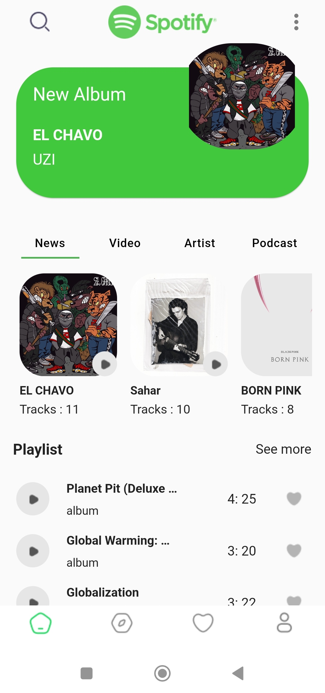
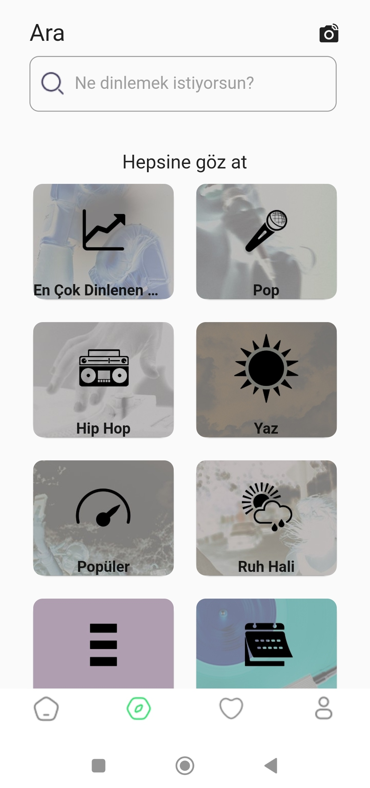
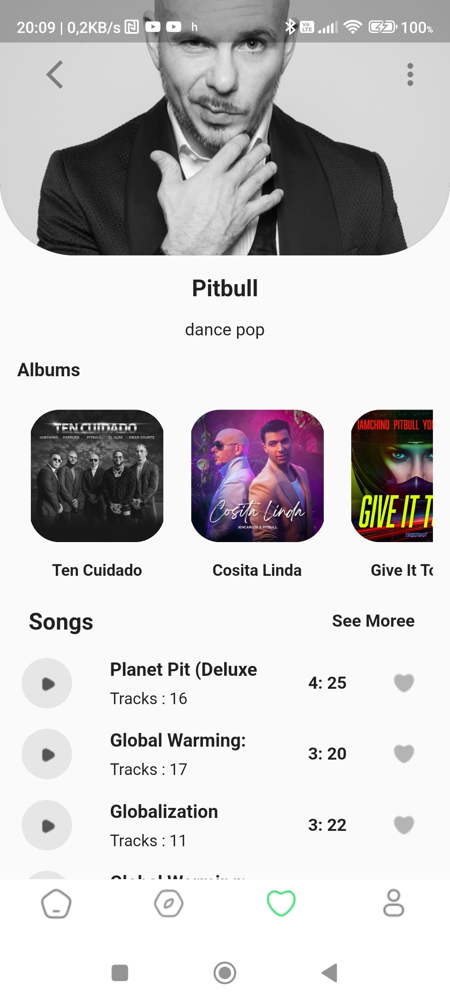
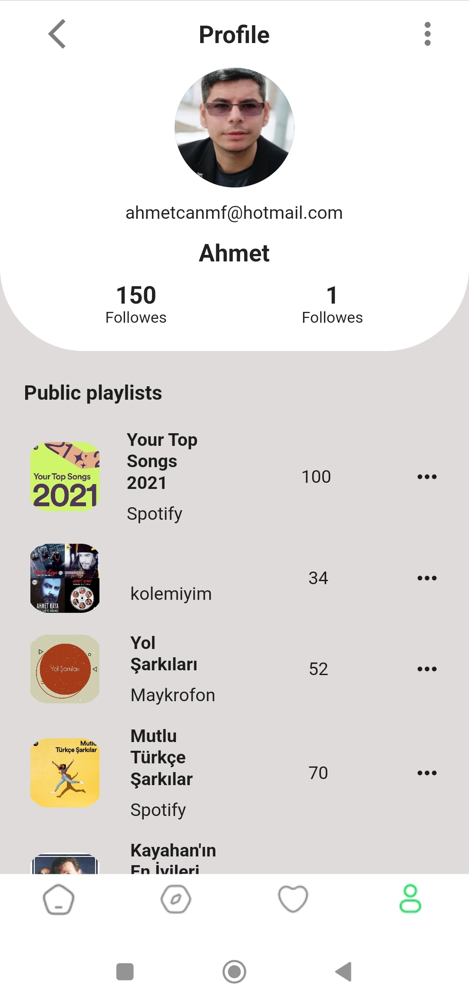

# [Spotify Api UI](https://www.figma.com/file/G6y7N6LQX84auDjNqBFKay/Spotify-Redesign)

## App Features.
- Viewing playlist using [Spotify Api](https://developer.spotify.com/)
- categories
- Play Lists under Categories
- featured playlists
- images belonging to playlist
- content search track and artists
- display by type of content searched

<p align="center">





</p>

**Packages used:**
 - responsive_sizer: ^3.1.1
 - contained_tab_bar_view: ^0.8.0
 - provider: ^6.0.4
 - dio: ^4.0.6

 ## How to use
 - First you need to create an api key from [Spotify api](https://developer.spotify.com/console/)
 - [Write the api key in the relevant place](https://github.com/TarkanKara/SpotifyUI_Api_MVVM/blob/master/lib/base/dio_client.dart) 

 ```
Authorization="<Bearer <your spotify api key>>"
```
To clone and run this application, you'll need [Git](https://git-scm.com/downloads) and [Flutter](https://flutter.dev/docs/get-started/install) installed on your computer. From your command line:

```
# Clone this repository
$ git clone https://github.com/TarkanKara/SpotifyUI_Api_MVVM.git
```

```
# Install dependencies
$ flutter pub get
```

```
# Run the app
$ flutter run
```
This project is just for fun, but if you have any crazy idea for this app feel free to contribute, or create request for the features. Any contributions you make are greatly appreciated.

# Contact me
<a href="https://www.linkedin.com/in/ansh-rathod-478a81210/">

</a>


